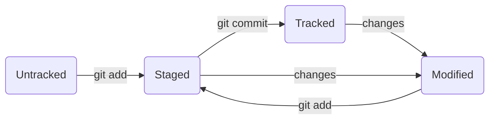

# GitHub
---
We are learning git and github right now, and this is our training task.

The link to Notion page with short summary of Yandex Practicum Course: https://www.notion.so/Git-Cheatsheet-5c60e0a9588d4a83b8e26e00b27a6be6?pvs=4

## 1 Getting to know GitHub

//Few words about GitHub, what it is, why we should or not use it 

## 2 Starting working with Git.

//Main commands to start git repository and etc

## * File .md how to work with them

//Few words about main rules and syntax

## File statuses. maybe put in second paragraph

## 3 Branches and all about it.

//Lets create some branches and try to split info in maybe more paragraphs?
