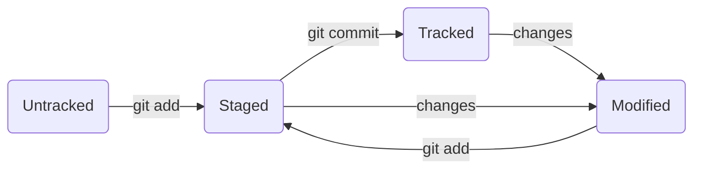

# GitHub
---
We are learning git and github right now, and this is our training task.  

---

## 1 Getting to know GitHub

Git is a **version control system** that helps track changes in a project. This tool can be used for both individual and team work.

Git allows you to save changes locally and, if necessary, return to previous versions of the project. You can also create a remote copy on a hosting platform that works with Git and share the result with others. 

In order for Git to start tracking changes in the project, the folder with the files of this project must be made a Git repository. 
* **git init**

## 2 Starting working with Git.

//Main commands to start git repository and etc
1. git init - initialize Git repository
2. git status - check repository status
3. git add - prepare files for saving
4. git commit - make commit
5. git remote add - bind a remote repository to a local one
6. git push - send changes to a remote repository
7. git pull - pick up changes from a remote repository
8. git restore --staged 'file' - perform unstage of changes
9. git reset --hard 'commit hash' - "roll back" commit
10. git clone - clone repository
11. git branch - view project branches 
12. git branch 'branch name' - create a branch
13. git checkout 'branch name' - switch to another branch
14. git merge 'branch name' - perform a merge
15. git branch -D 'branch name' - delete a branch after merging  

## * File .md how to work with them

//Few words about main rules and syntax

## File statuses. maybe put in second paragraph

## 3 Branches and all about it.

//Lets create some branches and try to split info in maybe more paragraphs?
